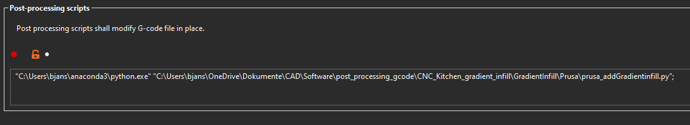
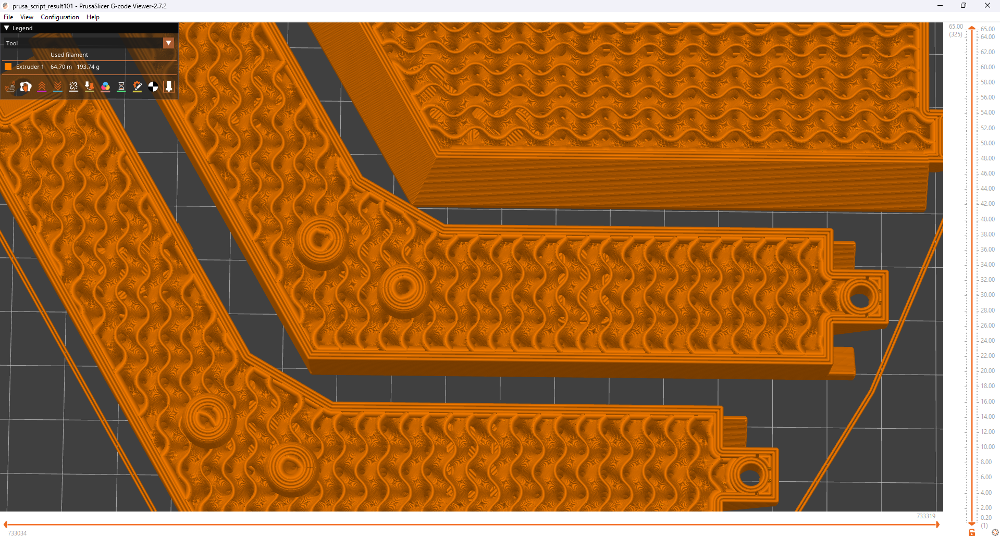

# Gradientinfill for Prusa slicer
## Introduction what changed?:
This is a fork of the repository of CNC-Kitchen. I didn't change the working principal of the script. I mainly adapted the comments within the gcode file to suit those generated by Prusa slicer and changed a few things which resulted in errors previously (used re patterns instead of searching for single characters in line). To understand better how the script works, i recommend watching the YouTube video and reading the README.md in the mainfolder. There you can also find instructions to install python (I'm using python 3.9.18 with the anaconda distribution). To my knowledge this is the first version working in Prusa slicer. If i'm mistaken, please let me know.

### First example print:
It's difficult to see the different line width of the infill on the picture. The test piece also needs to be large enough.

## Features:
- The script can be called directly after slicing with an optional dialog in the terminal, which will automatically open (``run_in_slicer = True``)
- It's also possible to run the script inside of an IDE (``run_in_slicer = False``)
- If the script didn't do any changes it will print a message. This means something went wrong.
- If a bug occurs the error message will be written inside of the terminal. When this happens please review, that all of the entered settings are correct. Open an issue here at this repository and share all your variables and the error message to get help.
- The first line of gcode will automatically be removed (optional), which contains information, which version of the slicer has been used. Without deleting the line Prusa gcode previewer will render the gcode based on the settings written at the end of the gcode <u>*not the actual gcode*</u>. This would give you a wrong impression of the actual gcode, which is why it's automatically removed.

## Slicer settings (enable expert mode):
### Disable Arc fitting in print settings-> advanced:

### Use relative extrusion in printer settings-> general:

### Infill before perimeter need to be turned off printer settings-> infill:

### Automatically call script when saving the file:

Insert the path to your python.exe followed by the path to the python script in print settings -> output options.

## Running script in slicer:
The script gets called after the slicing process. 
This means, that the preview inside of the slicer doesn't show the changes of the script.
There will be just one output file, so you can't compare them directly.
Either safe the gcode with the same settings, without running the script or run the script from an IDE, to get both files.

### Investigate the modified gcode (recommended):
The following steps are recommended and should be performed every time, until you trust the script. There might be errors specific to your gcode, which i haven't thought of. Those could potentially damage your printer.

Open the file inside of the Prusa gcode viewer, to take a look at the modified gcode. The changes from the script are best visible, when you look at the width or volumetric flow (check if your hotend can keep up with the maximum flow). If you are not happy with the result run the script again with different parameters. You can refresh the gcode preview by pressing F5.

When you are happy with the result open the two files inside of notepad++ and compare both files with a plugin called "compare". The program will mark all of the changes in between both files. This is the safest check, since the gcode previewer can give a wrong impression.

## General advice:
Experiment with the different parameters. For me a ``MAX_FLOW = 350`` was set to high and 250 worked better.

Print small test pieces to test your settings. If you modify a big file the computing time can be several minutes long.

You may need to lower the infill speed, since the flow increases with the use of the script.
Check in the preview, that it's not exceeding the maximum flow of the hotend. The line width of the infill shouldn't be much higher than the nozzle diameter in the slicer setting.

When you look at the second picture you can see that the flow in the inner core (outside of the ``GRADIENT_THICKNESS`` range) isn't changed. If you want a thin infill width in the core (where the forces are the lowest)
you can choose a small linewidth as infill linewidth, set ``MIN_FLOW = 100`` and adjust ``MAX_FLOW`` accordingly (increase).

## Prospect for the future:
I will try to optimize the calculation time of the script.
With your help i will debug the script for errors, which might occur.

I might add an option, which modifies the Infill speed, to prevent exceeding the maximum flow. 

You may also be interested in my own postprocessing scripts, which can be found [here](https://github.com/WatchingWatches/Post_processing_gcode).

Thank you for you feedback in advance. Also feel free to adapt the script to other slicers too.